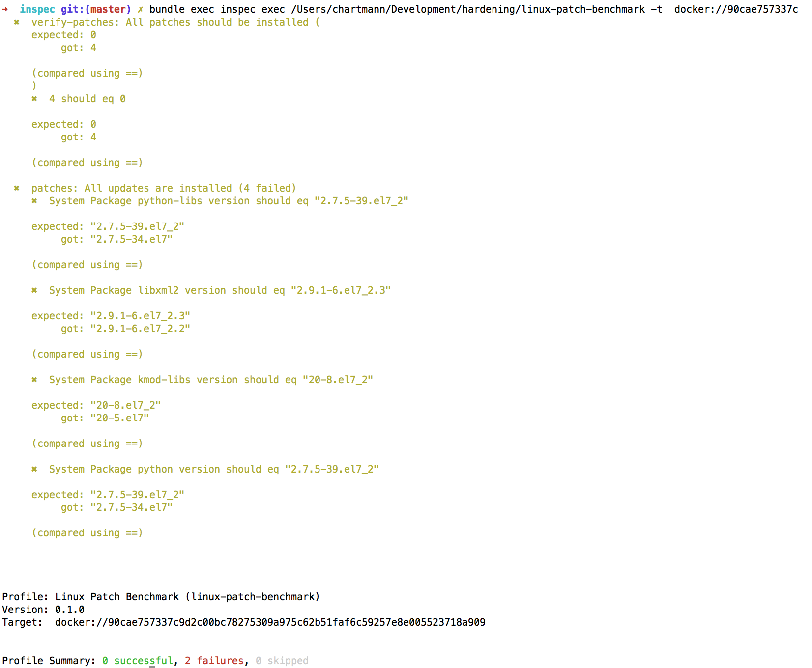

# Linux Patch Benchmark

This [InSpec](http://inspec.io/) profile verifies that all updates have been installed on a RedHat/CentOS/Ubuntu machine. It uses the local package manager to determine the available packages.

## Supported Operating Systems

- RHEL 6/7
- CentOS 6/7
- Ubuntu 12.04+
- OpenSUSE, SuSE 11/12

## License

|  |  |
| ------ | --- |
| **Author:** | Dominik Richter (<dominik.richter@googlemail.com>) |
| **Author:** | Christoph Hartmann (<chris@lollyrock.com>) |
| **Copyright:** | Dominik Richter (<dominik.richter@googlemail.com>) |
| **Copyright:** | Christoph Hartmann (<chris@lollyrock.com>) |
| **License:** | Mozilla Public License Version 2.0 |
